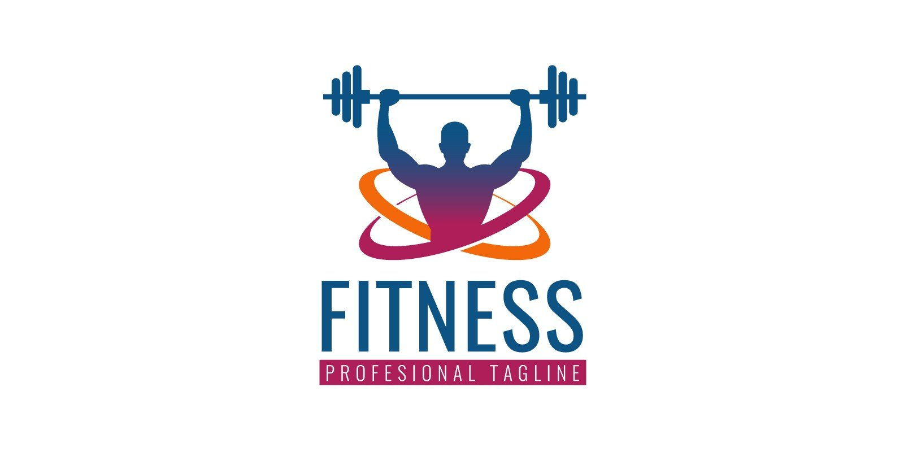

<h1>PS02 Gym Management System</h1>

 
 ---

<h3>Description:</h3> 

 

The PS02 Gym Management System is a comprehensive software application meticulously designed to optimize and simplify the operational facets of fitness facilities. This innovative solution arises from a distinct observation of the prevailing manual methodologies frequently employed within local fitness establishments. Drawing inspiration from this common practice, our system provides an efficient digital alternative tailored for gym administrators. 

This feature-rich system orchestrates an array of vital functions within a gym environment, encompassing member and trainer management, precise session tracking, and the convenient exportation of essential data. It empowers administrators with the tools required to oversee gym operations seamlessly, ensuring an enhanced experience for both staff and clients alike. 

 

 ---

<h3>Table of Contents:</h3> 

 

Installation 

Features 

Usage 

Configuration 

Security 

Contributing 

License 

 

 

 ---

<h3>Installation:</h3> 

 

To run gym management system, follow these steps: 

 

Clone the repository on your machine: 

 
	git clone https://github.com/pavle0402/Gym-management-.git

 

Navigate to the project directory: 

cd your-path-to-gymmanagementsystem 

 

3. Create a virtual environment (optional but recommended) and activate it: 

python –m venv venv 

 

 

4. Activate your virtual environment: 

On windows: 

venv/Scripts/activate 

 

On macOS/Linux: 

Source venv/bin/activate 

 

5. Install project dependencies: 
	pip install –r requirements.txt 

 

6. Configure database connections in settings.py. 

 

7. Apply database migrations: 

py manage.py migrate 

 

8. Create superuser(staff) account: 

py manage.py createsuperuser(then you will be asked to provide 	username, email and password)  

9. Start a development server: 

py manage.py runserver 

 

Application should now be running on: http://localhost:8000. 

 

 
---
<h3>Key Features:</h3> 

Member and Trainer Management: Easily add, edit, and delete gym members and trainers. 

Mentor Assignments: Admins can assign trainers as mentors to members who opt for personalized guidance. 

Session Tracking: Keep track of each member's remaining sessions efficiently. (This Django function operates via HTTP POST and deducts training sessions from a member if sessions remain. It returns a JSON response indicating the operation's status. 

It's important to note that this manual session subtraction isn't RFID-based or real-time. While valuable for manual session management, it's not a full RFID system. 

This serves as a foundation for potential enhancements like RFID integration, promising automation and improved system capabilities. It reflects my readiness for innovation.) 

Data Export: Generate lists of members and trainers for printing or reference. 

User Authentication: I have prioritized security by implementing login and logout functionality, recognizing the needs of smaller gyms that prefer manual admin creation over public registration. 

Info: Easy access to all the information about each trainer (trainer skills and list of members they are mentoring for example) or member (anything about members, from name to address, and number of sessions left, their mentor and so on...) 

 
 
 
 

 
 ---

<h3>Security:</h3> 

 

Security is a top priority for the PS02 Gym Management System. The system incorporates user authentication and authorization to ensure that only authorized administrators have access to sensitive data and there is no public registration. 

 

 
 ---

<h3>Configuration</h3> 

You can customize various aspects of the PS02 Gym Management System by editing the configuration files: 

settings.py: Configure database settings, secret keys, and other Django-related configurations. 

 

  ---

<h3>Contributing</h3> 

Contributions to the project are welcome! If you would like to contribute, please follow these guidelines: 

Fork the repository. 

Create a new branch for your feature or bug fix. 

Make your changes and commit them with descriptive messages. 

Push your branch to your fork. 

Submit a pull request with a clear explanation of your changes. 

 
 ---
<h3>Project preview(screenshots)</h3>
For a more comprehensive view of the application's interface and features, you can explore additional screenshots located in the `screenshots/` folder of this repository.
Below are two of the most important screenshots:
<h5>Members and trainers list</h5>

  
  

 
 ---

<h3>Project Motivation and Goals:</h3> 

I conceived the idea for the PS02 Gym Management System in response to a common practice in my town, where many gyms rely on manual methods like notebooks for session tracking for example. As someone deeply interested in fitness and software development, I saw an opportunity to create an efficient digital alternative. This project not only allows me to showcase my technical skills but also provides a practical solution to a real-world problem. Additionally, I aimed to differentiate my portfolio by steering away from more conventional projects like e-commerce sites since there are millions of tutorials on how to make that. 

 

 

For any questions or inquiries, contact me at pavles2002@gmail.com 

 

 

 

All set and done just add section for screenshots for preview of project, already added the folder for that, just implement it in readme file. 
